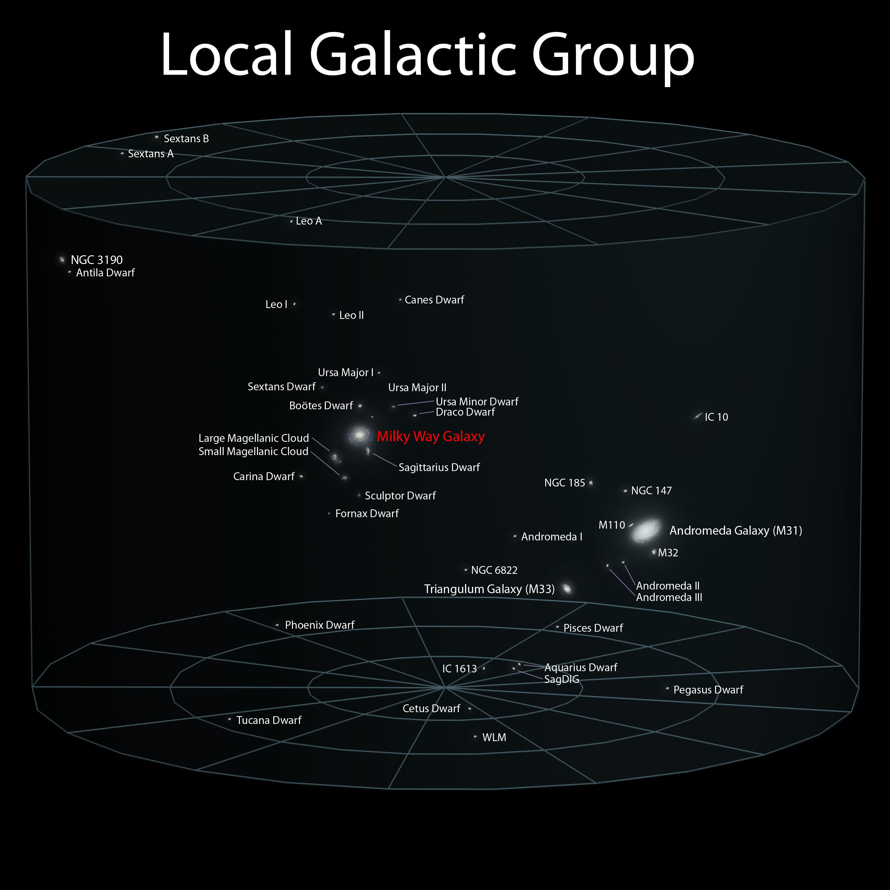
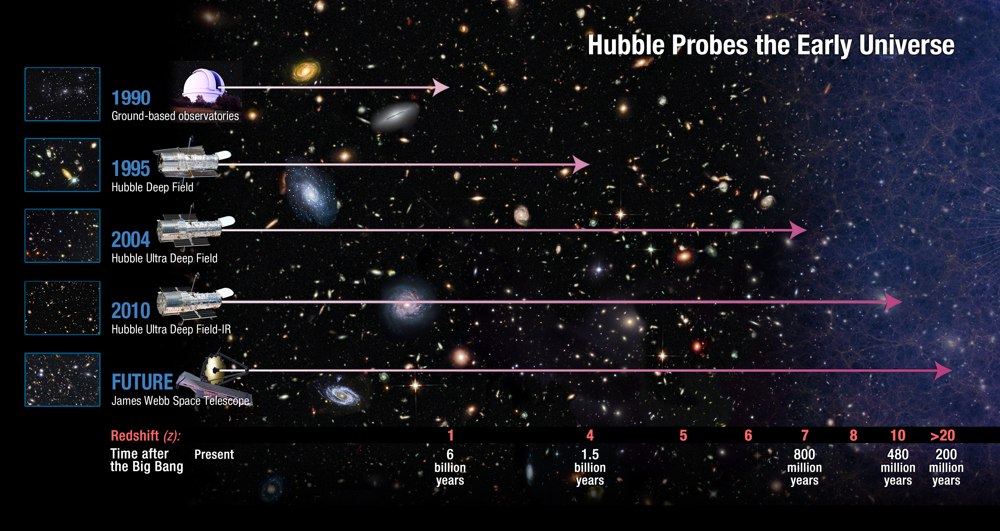

<style type='text/css'>
img {
    max-height: 560px;
    max-width: 964px;
}
</style>

<!-- Center image on slide -->
<script src="http://ajax.aspnetcdn.com/ajax/jQuery/jquery-1.7.min.js"></script>
<script type='text/javascript'>
$(function() {
    $("p:has(img)").addClass('centered');
});
</script>


---



---

```{r fig.width=9,fig.height=9,fig.align='center',message=FALSE,echo=FALSE}
barplot(c(69.4,25.8,4.8), main="Energy Content of the Universe", names.arg = c("Dark Energy", "Dark Matter", "Baryonic Matter"), col=c("Purple","Blue","Yellow"))
```

--- 

<iframe width="560" height="315" src="https://www.youtube.com/embed/UC5pDPY5Nz4?rel=0&amp;controls=0&amp;showinfo=0" frameborder="0" allowfullscreen></iframe>

---

<iframe width="560" height="315" src="https://www.youtube.com/embed/7KmbQ02JE3g?rel=0&amp;controls=0&amp;showinfo=0" frameborder="0" allowfullscreen></iframe> 

---



